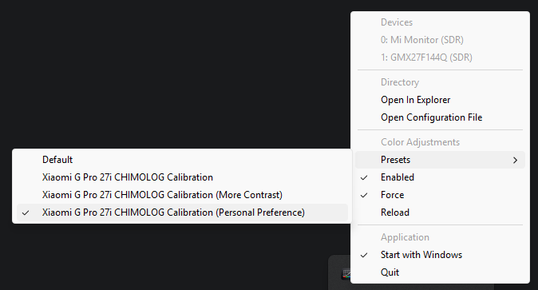

# Color LUT Tweaks

Small Windows CLI for loading raw `.lut` gamma ramps and applying them when HDR or SDR is active. With this application,
you can load separate `.lut` files everytime you switch to HDR or SDR mode.

You can also use this tool to apply EOTF correction for HDR or SDR only.

## Installing

Download the latest [release](https://github.com/HugoSart/color-lut-tweaks/releases), or download the source code of this project and build it using `cargo`:
```shell
cargo build --release
```

This will build the project in `target/release`, where it's ready to be executed. Important files:
- `luts/`: optional pre-built LUTs folder; it's recommended to copy this folder to the same folder as the 
           executable if you decide to move the executable somewhere else.
- `configs/`: pre-built configurations files (shown in "Presets" menu);
- `color-lut-tweaks.exe`: the main executable;

## Configuration

The configuration file is a JSON array of LUTs to load.

The following example shows a configuration that loads the identity LUT when you are in SDR (i.e. no color correction)
and a custom LUT when you are in HDR:
```json
[
  {
    "device": 0,
    "mode": "sdr",
    "lut": "identity"
  },
  {
    "device": 0,
    "mode": "hdr",
    "lut": "./path-to-my-lut.lut",
    "adjust": {
      "contrast": 1.00,
      "brightness": 0.0,
      "gamma": 1.0,
      "gain": [1.0, 1.0, 1.0],
      "offset": [0.0, 0.0, 0.0]
    }
  }
]
```

### Xiaomi G Pro 27i Users
This project also includes a default Xiaomi G Pro 27i HDR EOTF curve correction (because this is what motivated me to 
create this tool). You can use it by simply starting the application and selecting the desired preset. If the monitor
device id is not 0, click on the "Open Configuration File" button and manually edit the device number.



Xiaomi Presets:
- Xiaomi G Pro 27i CHIMOLOG Calibration:
  - Apply Native -> SRGB color conversion for SDR usage;
  - Apply EOTF correction for HDR usage;
- Xiaomi G Pro 27i CHIMOLOG Calibration (More Contrast):
  - Same as above;
  - Boost contrast;
- Xiaomi G Pro 27i CHIMOLOG Calibration (Personal Preference):
  - Same as above;
  - Decrease red gain on SDR mode;
  - Slightly increase red gain on HDR mode;
  - This one is personal preference and may not apply to your config.

## Running
After having your project build and configuration in place, run the executable. It will start running in the background
and will appear in the system tray.

```shell
color-lut-tweaks.exe
```

---
## LUT Format

**LUT** stands for "Look Up Table", and in this context it refers to a set of gamma ramps that can be applied to a color
space.

`.lut` files are expected to be raw Windows gamma ramps:

```text
WORD ramp[3][256]
```

That means:

- `1536` bytes total
- 3 channels: red, green, blue
- 256 `u16` entries per channel
- little-endian encoding
